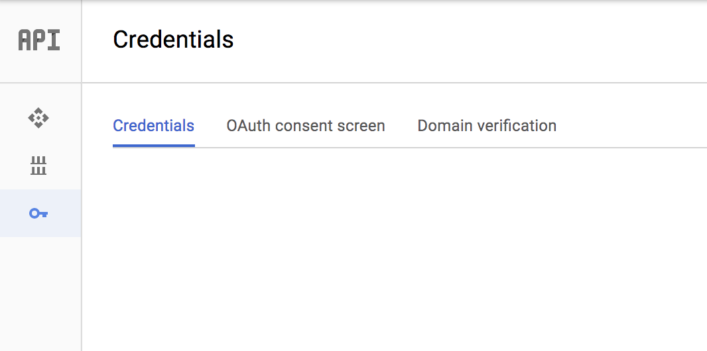
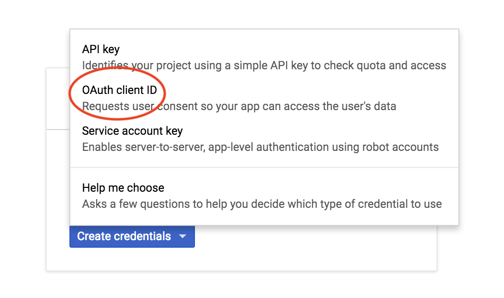
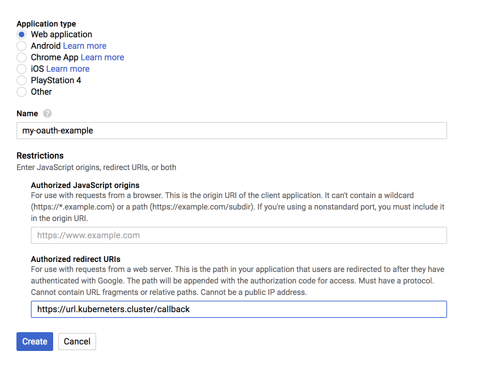

# Connexion de Gangway à Google
Il est possible d'utiliser Google comme fournisseur OAuth avec Gangway. Pour ce faire, suivez les instructions ci-dessous :

## Configuration de l'OAuth Google

* Rendez-vous dans la zone des identifiants de Google Cloud : `https://console.cloud.google.com/apis/credentials?project=<nom-de-votre-projet-google-cloud>`.
Si vous n'avez pas encore créé d'identifiants, vous devriez voir une liste vide.



* Sur cette page, cliquez sur "Créer des identifiants". Un menu apparaîtra. Dans ce menu, cliquez sur "ID client OAuth".



* Sur la page où vous arriverez, choisissez "Application Web" pour le type, donnez un nom à l'ID client OAuth, remplissez l'URL de rappel de manière appropriée, puis cliquez sur "Créer".



* Si la création est réussie, une fenêtre modale vous demandera si vous souhaitez copier l'ID client et le secret. Cliquez sur "OK" pour fermer.

* Dans la liste, vous devriez voir les identifiants que nous venons de créer. À droite, il y a 3 icônes d'action. Cliquez sur la flèche "télécharger" vers le bas.

## Configuration de Gangway

Vous devez maintenant configurer Gangway.
Voici un fichier de configuration typique :

```yaml
# Le nom de votre cluster. Il n'y a pas de correspondance stricte, donc cela peut être n'importe quoi
clusterName: "nom_de_votre_cluster"

# L'URL pour faire la découverte
providerUrl: "https://accounts.google.com/"

# ID client API. Obtenez-le dans le champ "client_id" des identifiants Google
clientId: "12345678901234567890.apps.googleusercontent.com"

# Secret client API. Obtenez-le dans le champ "client_secret" des identifiants Google
clientSecret: "FRGegerwgfsFE_fefdsf"

# Point de terminaison qui fournit des informations sur le profil utilisateur.
# Pour Google, c'est le même que votre client_id
audience: "923798723208-9pq62pkrnbhumipnqs4v0a1iu7ij01fo.apps.googleusercontent.com"

# Où rediriger ensuite. Cela devrait être une URL
# Où Gangway est accessible. Ne peut pas être une adresse IP brute. Doit être un TLD valide.
redirectUrl: "https://url.kuberneters.cluster.com/callback"

# Utilisé pour spécifier la portée de l'autorisation demandée en OAuth.
# Contrairement à Auth0, nous n'avons pas besoin de "offline"
scopes: ["openid", "profile", "email"]

# Quel champ regarder dans le jeton pour extraire le nom d'utilisateur, laissez tel quel
usernameClaim: "sub"

# Quel champ regarder dans le jeton pour extraire l'email, laissez tel quel
emailClaim: "email"

# Le serveur API à utiliser lors de la configuration de kubectl pour l'utilisateur
apiServerURL: "https://kube-apiserver.yourcluster.com"
```