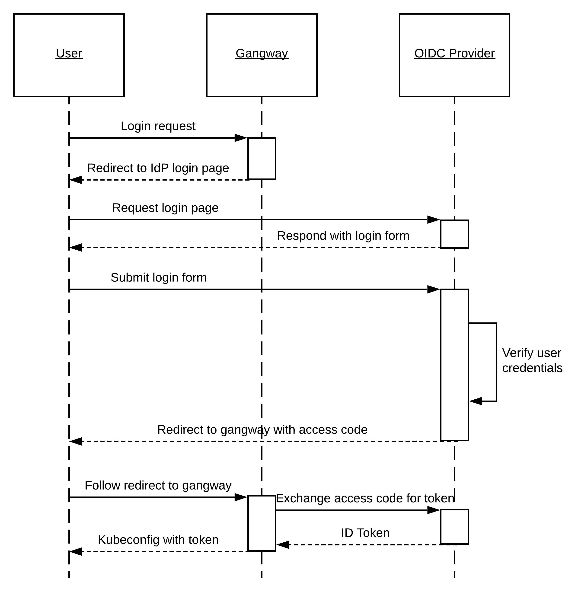

# Comment ça fonctionne

Kubernetes prend en charge OpenID Connect (OIDC) comme mécanisme d'authentification des utilisateurs. OIDC est un
protocole d'authentification qui permet aux serveurs de vérifier l'identité d'un utilisateur via un jeton d'identité (ID Token).

Lors de l'utilisation d'OIDC pour s'authentifier auprès de Kubernetes, le client (par exemple, `kubectl`) envoie le jeton d'identité
avec toutes les requêtes au serveur API. Du côté serveur, le serveur API de Kubernetes vérifie le
jeton pour s'assurer qu'il est valide et n'a pas expiré. Une fois vérifié, le serveur API extrait les informations de nom d'utilisateur et d'appartenance à des groupes du jeton, et continue le traitement de la requête.

Pour obtenir le jeton d'identité, l'utilisateur doit passer par le processus d'authentification OIDC. C'est là
que Gangway intervient. Gangway est une application web qui permet le flux d'authentification OIDC qui
résulte dans la création du jeton d'identité.

Gangway est configuré comme un client d'un service d'identité en amont qui parle OIDC. Pour obtenir le jeton
d'identité, l'utilisateur accède à Gangway, initie le flux OIDC en cliquant sur le bouton "Se connecter", et
complète le flux en s'authentifiant auprès du service d'identité en amont. Les identifiants de l'utilisateur ne sont
jamais partagés avec Gangway.

Une fois le flux d'authentification terminé, l'utilisateur est redirigé vers une page Gangway qui fournit
des instructions sur la façon de configurer `kubectl` pour utiliser le jeton d'identité.

Le diagramme de séquence suivant détaille le flux d'authentification :

