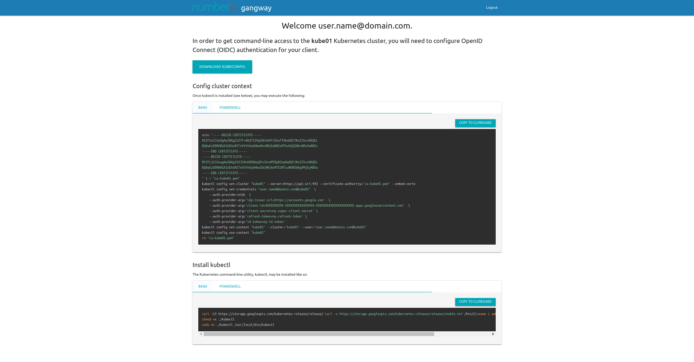

# Gangway documentation

gangway
=======

_(noun): An opening in the bulwark of the ship to allow passengers to board or leave the ship._

An application that can be used to easily enable authentication flows via OIDC for a kubernetes cluster.
Kubernetes supports [OpenID Connect Tokens](https://kubernetes.io/docs/reference/access-authn-authz/authentication/#openid-connect-tokens) as a way to identify users who access the cluster.
Gangway has been improved and is now able to handle multiple clusters
Gangway allows users to self-configure their `kubectl` configuration in a few short steps.

Once authenticated for one of your cluster : 

